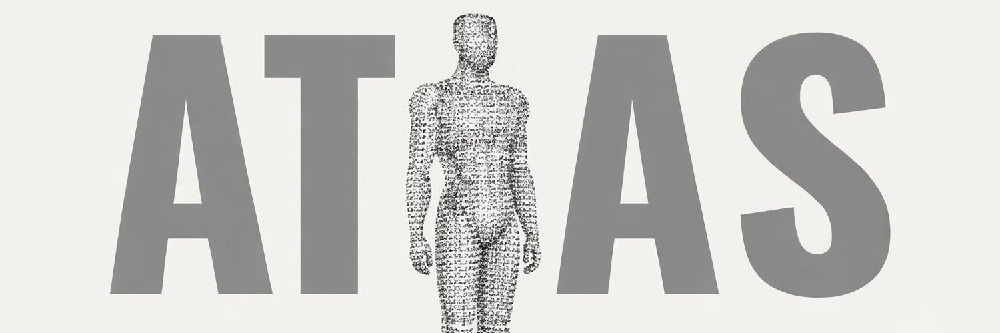

# Humanoid Atlas

Interactive supply chain intelligence platform for the humanoid robotics industry. Explore OEM ecosystems, component suppliers, geopolitical dependencies, and AI-powered strategic analysis — all in the browser.

**Live at [humanoids.fyi](https://www.humanoids.fyi)**



## Features

- **3D Component Viewer** — Point-cloud renderings of robotics hardware (motors, batteries, actuators, bearings) using Gaussian Splat PLY files rendered as stippled point clouds via Three.js
- **Supply Chain Graph** — Interactive network visualization of OEM-supplier relationships across 17 humanoid robot companies and 50+ suppliers
- **Geopolitical Exposure** — Country-level dependency analysis for supply chain risk assessment
- **AI Analysis** — Groq-powered investment theses, competitive comparisons, scenario modeling, and semantic search
- **Component Deep Dives** — Detailed breakdowns across motors, reducers, bearings, actuators, screws, batteries, compute, sensors, PCBs, and end effectors
- **Competitive Comparison** — Side-by-side OEM specs and capability analysis
- **Timeline View** — Buildout and production ramp tracking

## Getting Started

### Prerequisites

- Node.js 18+
- pnpm (recommended) or npm

### Setup

```bash
git clone https://github.com/kingjulio8238/humanoid-atlas.git
cd humanoid-atlas
pnpm install
```

Copy the env template and fill in your keys:

```bash
cp .env.example .env.local
```

| Variable | Required | Source |
|----------|----------|--------|
| `GROQ_API_KEY` | Yes (for AI features) | [console.groq.com](https://console.groq.com) |
| `UPSTASH_REDIS_REST_URL` | No (view counter only) | [console.upstash.com](https://console.upstash.com) |
| `UPSTASH_REDIS_REST_TOKEN` | No (view counter only) | [console.upstash.com](https://console.upstash.com) |

### Development

```bash
pnpm dev
```

Open [http://localhost:5173](http://localhost:5173).

### Build

```bash
pnpm build
pnpm preview
```

### Lint

```bash
pnpm lint
```

## Project Structure

```
├── api/                    # Vercel serverless functions
│   ├── company-chat.ts     # Company-specific AI Q&A
│   ├── compare.ts          # Competitive analysis
│   ├── graph-query.ts      # Supply chain graph queries
│   ├── investment-thesis.ts# Investment analysis
│   ├── scenario-parse.ts   # Scenario impact parsing
│   ├── scenario-summary.ts # Scenario summaries
│   ├── smart-search.ts     # Semantic search
│   └── views.ts            # View counter (Upstash Redis)
├── src/
│   ├── App.tsx             # Main application
│   ├── components/
│   │   ├── DetailPanel.tsx # Company/supplier detail views
│   │   ├── PLYViewer.tsx   # 3D point cloud renderer
│   │   └── SupplyChainGraph.tsx # Network graph
│   └── data/
│       ├── companies.ts    # OEM & supplier data
│       ├── components.ts   # Hardware component definitions
│       ├── relationships.ts# Supply chain edges
│       └── types.ts        # TypeScript interfaces
├── public/models/          # PLY point cloud files + robot images
└── index.html
```

## Data Model

The supply chain data lives in `src/data/` and is structured as:

- **Companies** — OEMs (Tesla, Figure, Unitree, etc.) and suppliers with specs, funding, HQ location
- **Relationships** — Directed edges between companies with component type, confidence level, and source
- **Components** — Hardware category definitions with descriptions

### Contributing Data

The most impactful way to contribute is improving the supply chain dataset. To add or update data:

1. Edit files in `src/data/`
2. Follow the existing TypeScript interfaces in `types.ts`
3. Include a `source` field with a URL for any new relationships
4. Set an appropriate `confidence` level (`confirmed`, `likely`, `speculative`)

## Contributing

Contributions are welcome! Whether it's new data, bug fixes, UI improvements, or new features.

1. Fork the repo
2. Create a feature branch (`git checkout -b feature/my-feature`)
3. Commit your changes
4. Push to your fork and open a Pull Request

## License

[MIT](LICENSE)
